# Le NoteAPI in DRF

**Developer: Aleksandra Haniok**

💻 [Live link](https://snapfood-drf-api.onrender.com/)

This repository contains the API set up using Django REST Framework for "Le Note" front-end application ([repository here](https://github.com/Gavriil1/CI-PP5-API) and [live website here](https://ci-pp5-snapfood.onrender.com))

## Table of Contents
  - [User Stories](#user-stories)
  - [Database](#database)
  - [Technologies Used](#technologies-used)
  - [Validation](#validation)
  - [Testing](#testing)
  - [Credits](#credits)

## User Stories

The back-end section of the project focuses on its administration side and covers one user story:
- As an admin, I want to be able to create, edit and delete the users, notes, likes, so that I can have a control over the content of the application and remove any potential inappropriate content

## Database

The following models were created to represent the database model structure of the application:
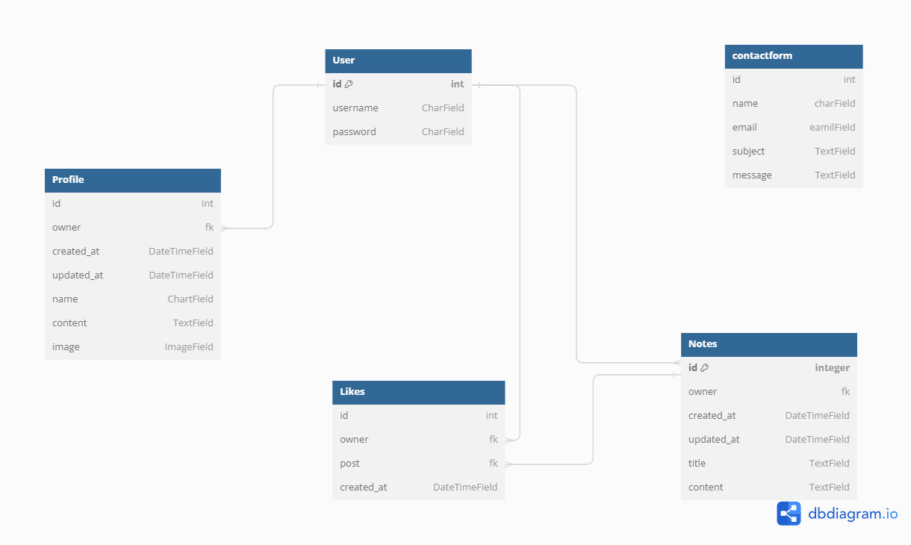

#### User Model

- The User model contains information about the user. It is part of the Django allauth library.
- One-to-one relation with the Profile model owner field
- ForeignKey relation with the Notes model owner field
- ForeignKey relation with the Like model owner field

#### Profile Model

- The Profile model contains the following fields: id, owner, created_at, updated_at, name, content, image
- One-to-one relation between the owner field and the User model id field

#### Notesd Model

- The Post model contains the following fields: id, owner, created_at, updated_at, title, content
- ForeignKey relation with the Like model post field

#### Like Model

- The Like model contains the following fields: id, owner, post and created_at
- ForeignKey relation between to the User model id field
- ForeignKey relation between the owner field and the User model id field
- ForeignKey relation between the post field and the Post model post field

##### Back to [top](#table-of-contents)

## Technologies Used

### Languages & Frameworks

- Python
- Django

### Libraries & Tools

- [APITestCase](https://www.django-rest-framework.org/api-guide/testing/) - Django Rest Framework APITestCase was used for automated testing
- [Cloudinary](https://cloudinary.com/) to store static files
- [Coverage](https://coverage.readthedocs.io/en/6.4.4/) used to produce automated testing report
- [Dbdiagram.io](https://dbdiagram.io/home) used for the database schema diagram
- [Git](https://git-scm.com/) was used for version control via Gitpod terminal to push the code to GitHub
- [GitHub](https://github.com/) was used as a remote repository to store project code
- [Gitpod)](https://gitpod.io/workspaces) - a virtual IDE workspace used to build this site
- [Render Platform](https://heroku.com) was used to deploy the project into live environment
- [Django REST Framework](https://www.django-rest-framework.org/) was used to build the back-end API
- [Django AllAuth](https://django-allauth.readthedocs.io/en/latest/index.html) was used for user authentication
- [Pillow](https://pillow.readthedocs.io/en/stable/) was used for image processing and validation
- [Psycopg2](https://www.psycopg.org/docs/) was used as a PostgreSQL database adapter for Python
- [PostgreSQL](https://www.postgresql.org/) – deployed project on Render uses a PostgreSQL database

##### Back to [top](#table-of-contents)

## Validation

### PEP8 Validation
[PEP8](https://pep8ci.herokuapp.com/) Validation Service was used to check the code for PEP8 requirements. All the code passes with no errors or warnings.

## Testing

The Manual test was carried out on the app:

### Manual testing of user stories

- As an admin, I want to be able to create, edit and delete the users, notes,and likes, so that I can have a control over the content of the application and remove any potential inappropriate content

**Test** | **Action** | **Expected Result** | **Actual Result**
-------- | ------------------- | ------------------- | -----------------
User | Create, update & delete user | A user can be created, edited or deleted | Works as expected
User | Change permissions | User permissions can be updated | Works as expected
Profile | Create, update & delete | User profile can be created, edited or deleted | Works as expected
Note | Create, update & delete | A post can be created, edited or deleted | Works as expected
Like | Create & delete | A like can be created or deleted (like / unlike post) | Works as expected

In addition, notes,  likes  can be created by logged-in users only. Users can only update or delete the content which was created by themselves.

Screenshots - USER

    

Create user

    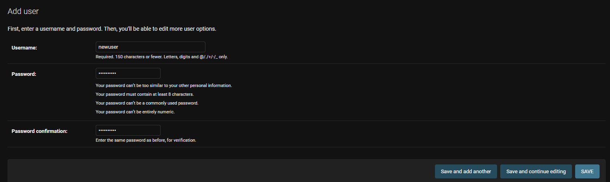
    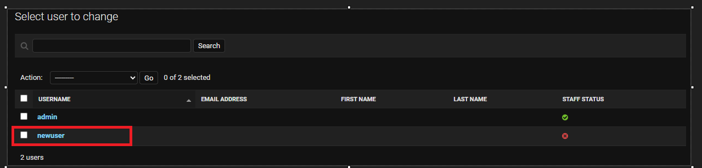
    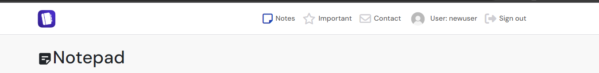
    

    

Change user permissions

    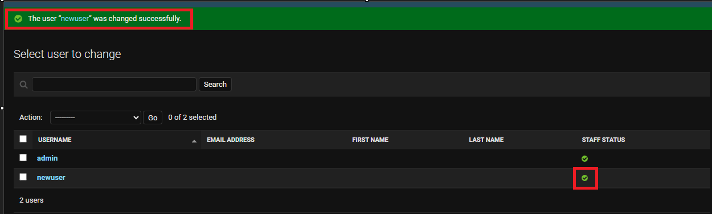
    

Screenshots - PROFILE

    

Update profile

    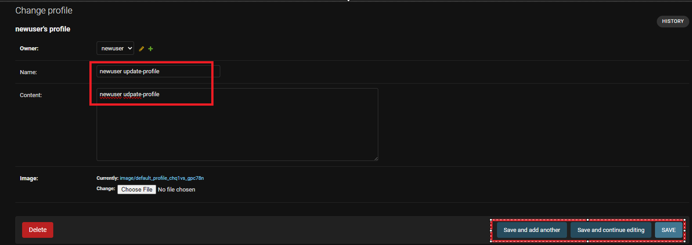
    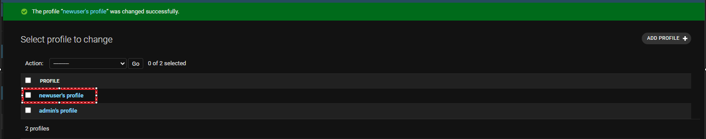
    

        

Delete profile

    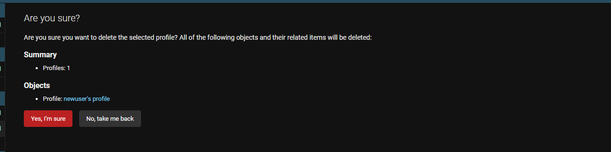
    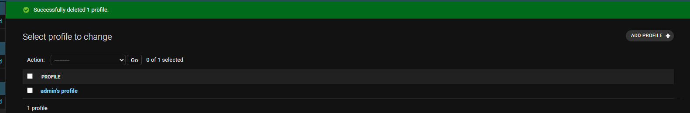
    

Screenshots - Notes

    

Create note

    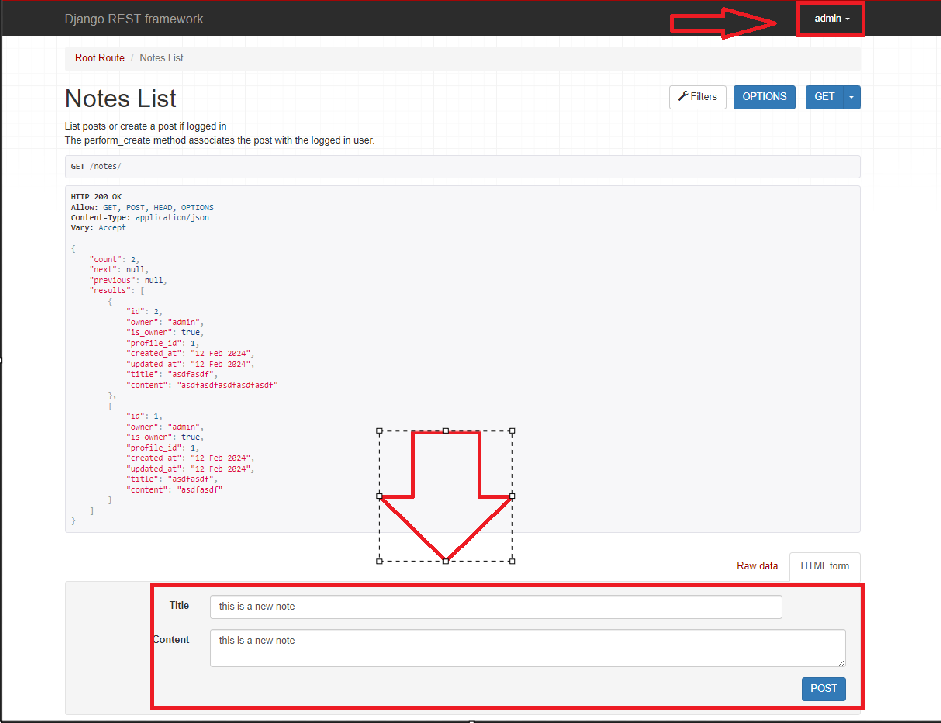
    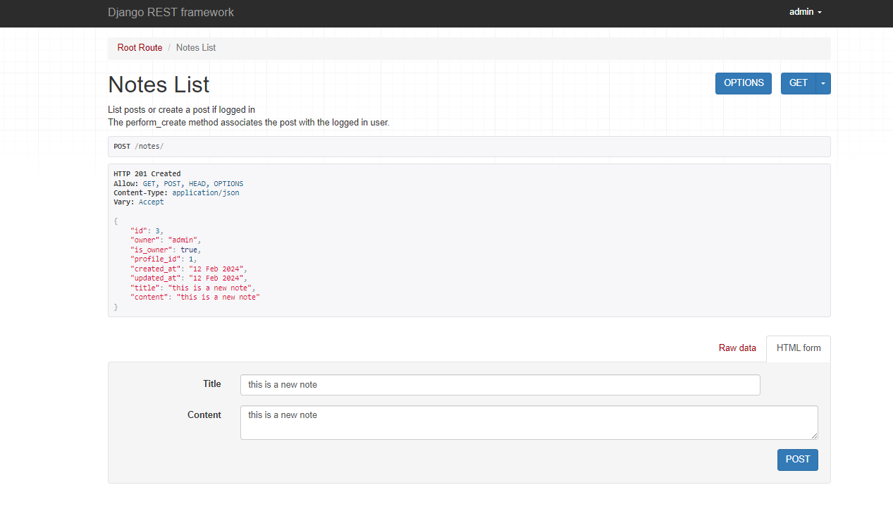
    

    

Update note

    
    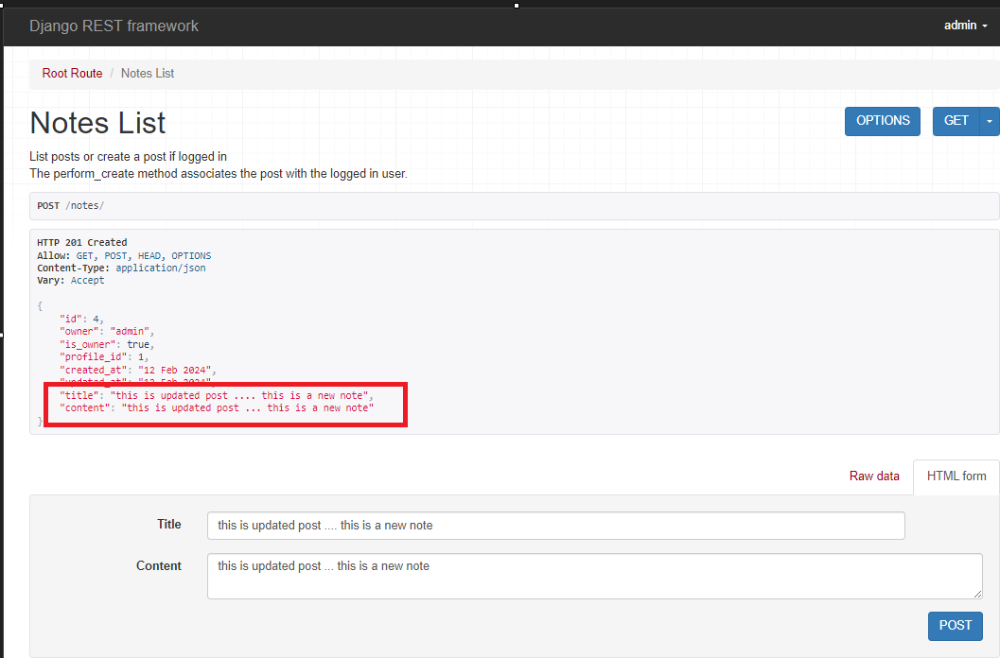
    

    

Delete note

    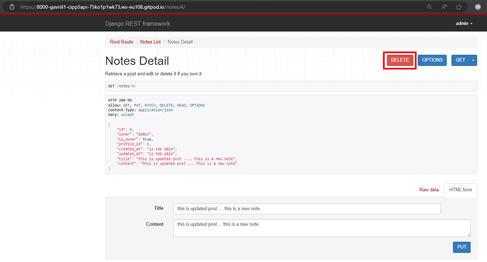
    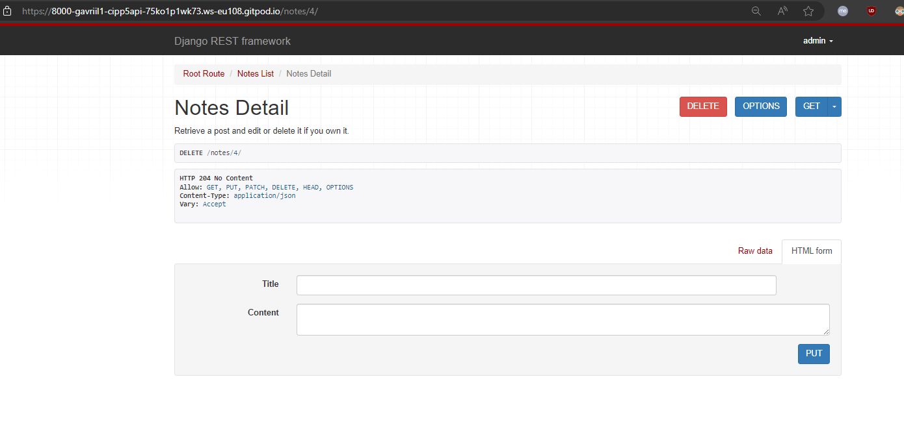
    

Screenshots - LIKE

    

Create like - like post

    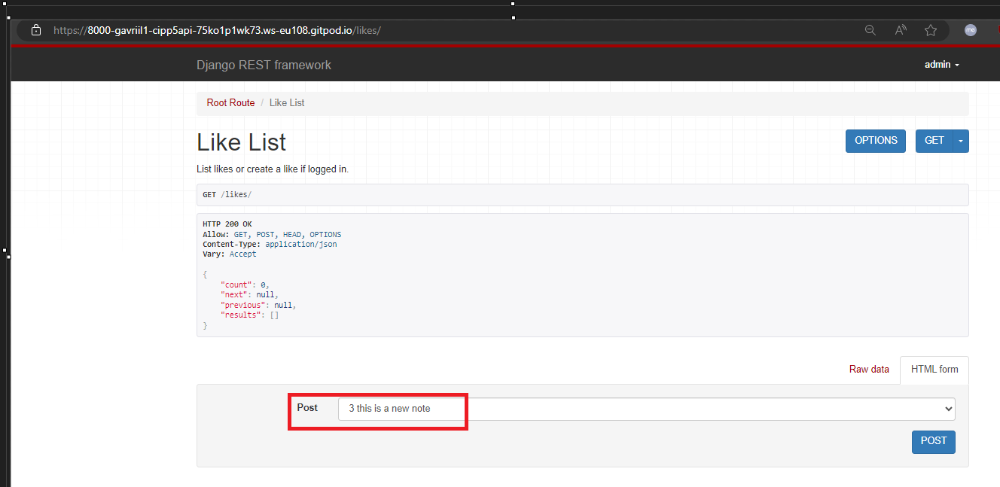
    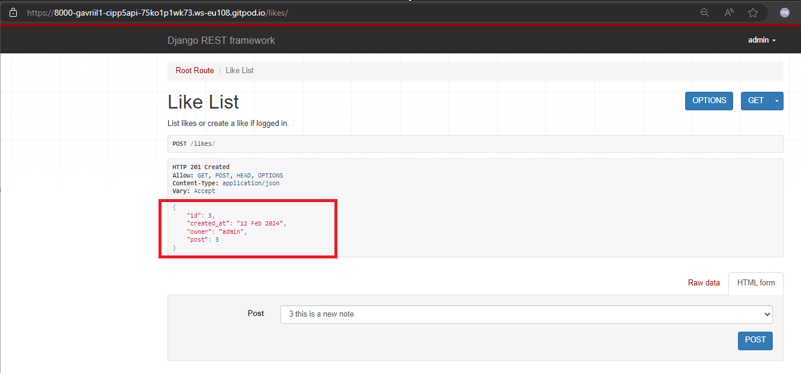
    

    

Delete like - unlike post

    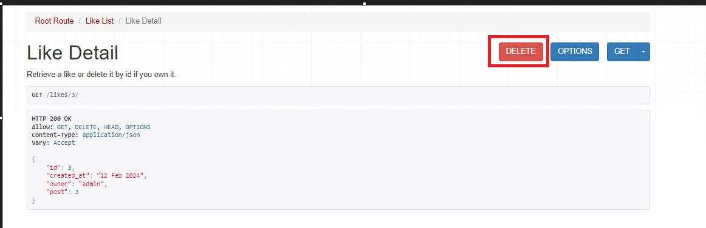
    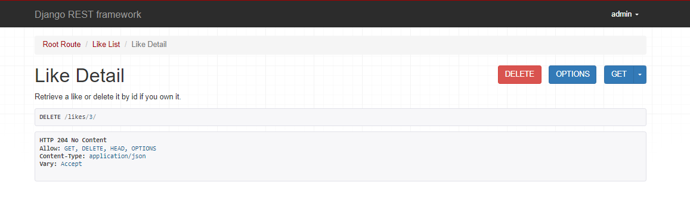
    

Screenshots - Feedback Message

    

Create note

    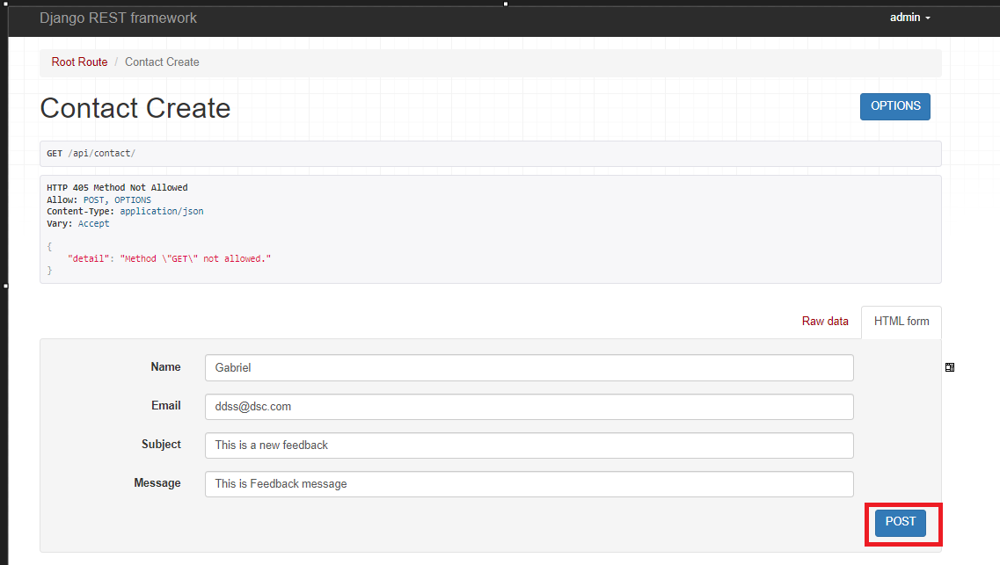
    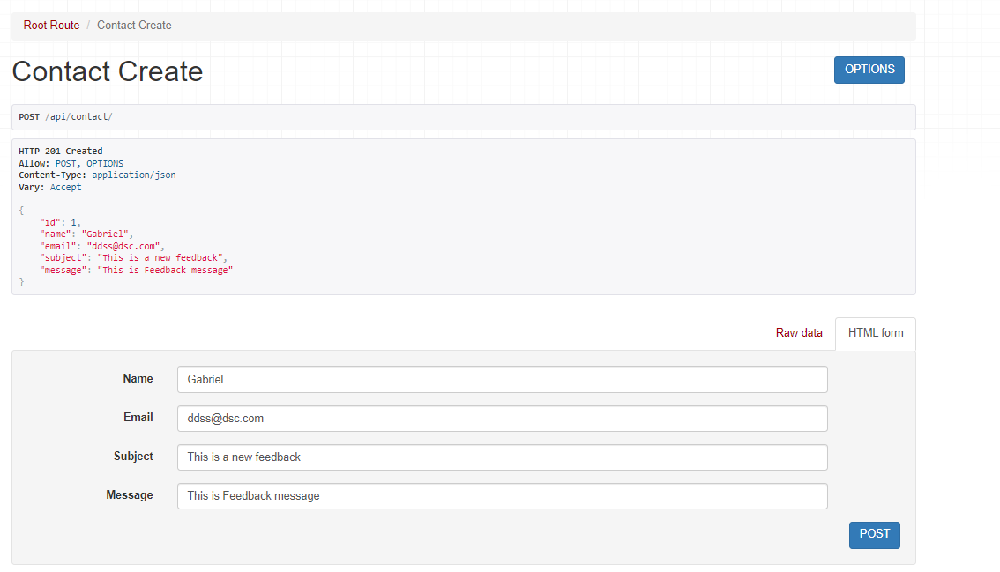
    

    

Update note

    
    
    

    

Delete note

    
    
    

##### Back to [top](#table-of-contents)

## Credits

### Images

- User avatar default image taken from [here](https://community.atlassian.com/t5/Jira-questions/JIRA-Anonymous-users-can-t-see-user-avatars/qaq-p/1060103) and colors changed using Paint
- Default post image found [here](https://www.fiverr.com/logo-maker/brief/logo_name?brief_id=0d212c49-2416-401d-99a5-780b9b233ff7) and tweaked with Paint

### Code

This project was created based on the Code Institute's Django REST API walkthrough project ['Moments'](https://github.com/Code-Institute-Solutions/drf-api).

##### Back to [top](#table-of-contents)