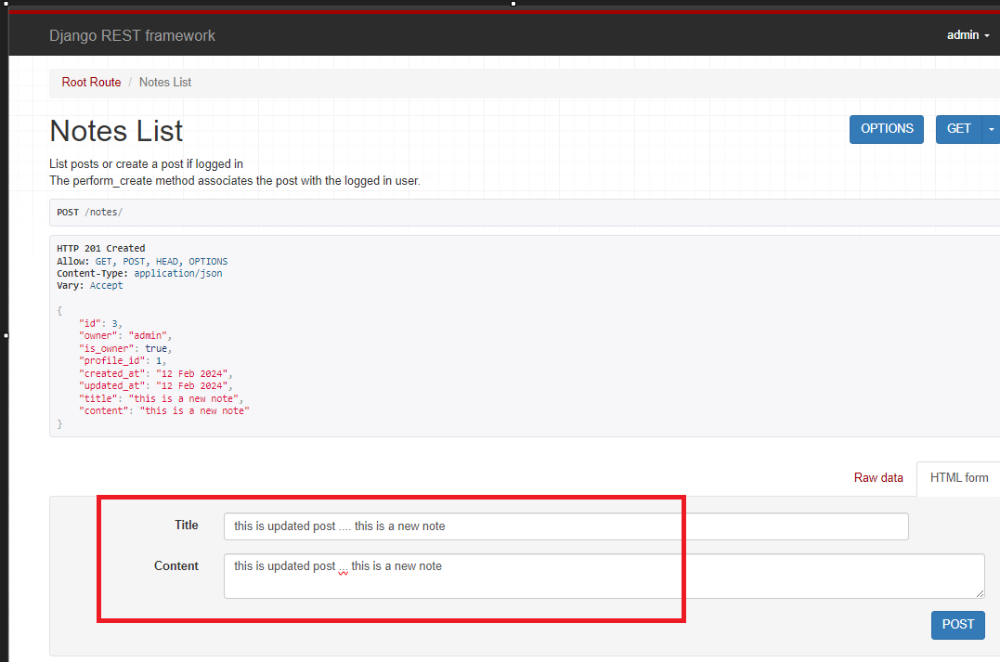
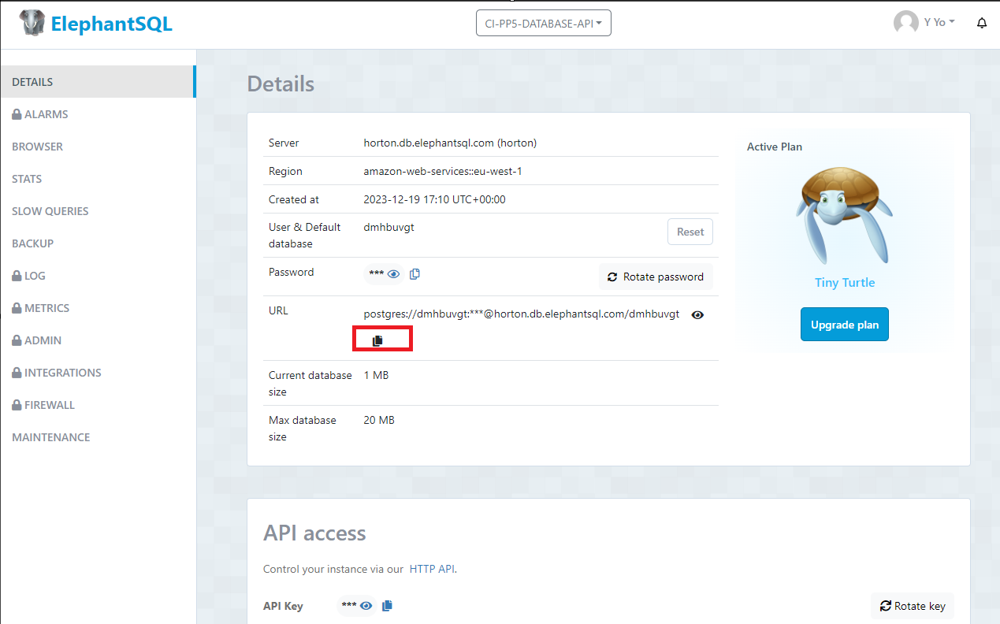

# Le NoteAPI in DRF

**Developer: Gavriil Spyropoulos**

💻 [Live link](https://ci-p5-project-api-part-500c148fe358.herokuapp.com/)

This repository contains the API set up using Django REST Framework for "Le Note" front-end application ([repository here](https://github.com/Gavriil1/CI-PP5-API) and [live website here](https://ci-p5-react-part-9d6b24103236.herokuapp.com/))

## Table of Contents
  - [User Stories](#user-stories)
  - [Database](#database)
  - [Technologies Used](#technologies-used)
  - [Validation](#validation)
  - [Testing](#testing)
  - [Deployment](#deployment)
  - [Credits](#credits)

## User Stories

The back-end section of the project focuses on its administration side and covers one user story:
- As an admin, I want to be able to create, edit and delete the users, notes, likes, feedback messages so that I can have a control over the content of the application and remove any potential inappropriate content

## Database

The following models were created to represent the database model structure of the application:

#### User Model

- The User model contains information about the user. It is part of the Django allauth library.
- One-to-one relation with the Profile model owner field
- ForeignKey relation with the Notes model owner field
- ForeignKey relation with the Like model owner field

#### Profile Model

- The Profile model contains the following fields: id, owner, created_at, updated_at, name, content, image
- One-to-one relation between the owner field and the User model id field

#### Notes Model

- The Post model contains the following fields: id, owner, created_at, updated_at, title, content
- ForeignKey relation with the Like model post field

#### Like Model

- The Like model contains the following fields: id, owner, post and created_at
- ForeignKey relation between to the User model id field
- ForeignKey relation between the owner field and the User model id field
- ForeignKey relation between the post field and the Post model post field

#### contactform Model

- The contactform model contains the following fields: id, name , email, subject and message
- contaactform has no ForeignKey with another database

##### Back to [top](#table-of-contents)

## Technologies Used

### Languages & Frameworks

- Python
- Django

### Libraries & Tools

- [Cloudinary](https://cloudinary.com/) to store static  files.
- [Dbdiagram.io](https://dbdiagram.io/home) used to create database diagram.
- [Git](https://git-scm.com/) was used for version control. The versions were pushed from gitpod to github.
- [GitHub](https://github.com/) The specified location served as a remote repository for storing project code.”
- [Gitpod](https://gitpod.io/workspaces) - was used as IDE
- [Heroku](https://heroku.com) was used to deploy the project into live environment
- [Django REST Framework](https://www.django-rest-framework.org/) was used to develop backend API website.
- [Django AllAuth](https://django-allauth.readthedocs.io/en/latest/index.html) was used as authentication plugin.
- [Pillow](https://pillow.readthedocs.io/en/stable/) was used for image processing and validation
- [Psycopg2](https://www.psycopg.org/docs/) was used as a PostgreSQL database adapter for Python
- [ElephantSQL](https://www.elephantsql.com/) – ElephantSQL was used during application development.

##### Back to [top](#table-of-contents)

## Validation

### PEP8 Validation
[PEP8](https://pep8ci.herokuapp.com/) A Validation Service was used to check the code for PEP8 requirements. All the code passed with no errors.

The only warning I have in my code is in the settings.py file, because two lines are too long. These two lines were generated automatically by the system upon the creation of the application. I was not able to shorten the lines without breaking the application:

158: E501 line too long (88 > 79 characters): 

167: E501 line too long (80 > 79 characters): 

## Testing

### Manual testing of user stories

- As an admin, I want to be able to create, edit, and delete users, notes, and likes, so that I can control the content of the application and remove any potentially inappropriate content.
- As an admin, I would like to receive feedback from a user and be able to delete it.

**Test** | **Action** | **Expected Result** | **Actual Result**
-------- | ------------------- | ------------------- | -----------------
User | Create, update & delete user | A user can be created, edited or deleted | Works as expected
User | Change permissions | User permissions can be updated | Works as expected
Profile | Create, update & delete | User profile can be created, edited or deleted | Works as expected
Note | Create, update & delete | A post can be created, edited or deleted | Works as expected
Like | Create & delete | A like can be created or deleted (like / unlike post) | Works as expected
Feedback Message | Create & delete | A Feedback message can be created or deleted  | Works as expected

In addition, notes,  likes, feedback messages  can be created by logged-in users only. Users can only update or delete the content which was created by themselves.

Screenshots - USER

    

Create user

    
    
    
    

    

Change user permissions

    
    

Screenshots - PROFILE

    

Update profile

    
    
    

        

Delete profile

    
    
    

Screenshots - Notes

    

Create note

    
    
    

    

Update note

    
    
    

    

Delete note

    
    
    

Screenshots - LIKE

    

Create like - like post

    
    
    

    

Delete like - unlike post

    
    
    

Screenshots - Feedback Message

    

Create Feedbac message

    
    
    

    

Delete Feedback Message

    
    
    
    

##### Back to [top](#table-of-contents)

## Deployment

The project was deployed to [Heroku](https://heroku.com). A live version of the API can be found at https://ci-p5-project-api-part-500c148fe358.herokuapp.com

The necessary steps to deploy the project are:
1. Clone or fork the repository. For forking it, go to https://ci-p5-project-api-part-500c148fe358.herokuapp.com/, click on `Fork` and follow the instructions. For cloning the repository run `gh repo clone Gavriil1/CI-PP5-API` in your terminal.

    

    
Show image

    
    

2. Create an account at https://cloudinary.com and get your Cloudinary URL from the dashboard by clicking on the URL under `API Environment variable`.

    

    
Show image

    
    

3. Create a PostgreSQL database, for example at https://www.elephantsql.com/. Create an account and after login in, click on `Create new instance` and follow the instructions. Click on your newly created database and get the URL from the database details.

    

    
Show image

    
    

4. Create an account at https://heroku.com and login. Then, start a new app from the [Heroku dashboard](https://dashboard.heroku.com) by clicking on `New` and then on `Create new app`.

    

    
Show image

    
    

5. Give your app an available name and choose your region (US or Europe).

6. Click on the *Deploy* tab and connect the Heroku app to your GitHub repository.

    

    
Show image

    
    

7. Scroll down and choose the branch you want to deploy in the *Manual deploy* section. Now click on `Deploy Branch` for the first deployment of the application.

    

    
Show image

    
    

8. After deployment click on `View` to open your deployed app.

    

    
Show image

    
    

9. In case you run into any issues you can access logs by clicking on `More` and then `View logs` or you can check the *Activity* tab for debugging.

    

    
Show image

    
    

## Credits

### Images

- The default user avatar image is taken from the Code Institute walkthrough.
- The website logo was found here : https://commons.m.wikimedia.org/wiki/File:OutlineApp_Logo.png

### Code

This project was created based on the Code Institute's Django REST API walkthrough project ['Moments'](https://github.com/Code-Institute-Solutions/drf-api).

##### Back to [top](#table-of-contents)